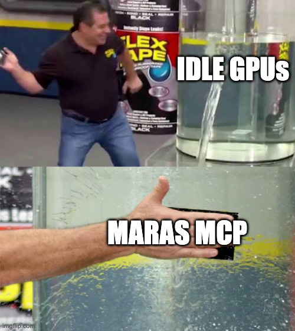

# Maras

Your perfect address.

Maras is a salt marketplace for mined contract addresses on Base Sepolia. Miners grind CREATE3 salts until one
produces a rare address, list it, and profit when buyers purchase the contract address.

Named for the salt terraces at Maras in Peru, where pink salt is harvested and sold to global markets.
Miners here harvest salts too!

**App:** [marasmarket.vercel.app](https://marasmarket.vercel.app)

**Agents:** [marasmarket.vercel.app/api](https://marasmarket.vercel.app/api)

**Contract:** [`0x7883a2913e1adee4e16860118218992f1cd36e02`](https://sepolia.basescan.org/address/0x7883a2913e1adee4e16860118218992f1cd36e02) on Base Sepolia, from block 46677670

## Why salts

Building a market in information an agent cannot inspect before paying runs into Arrow's information paradox: To prove information is worth buying, you have to show
it, and showing it gives it away.

I reason that selling it even once effectively makes it public, because the buyer can republish it (for free, if they so choose), so its resale value drops to zero. Most information markets escape this paradox by having
sampleable data: you can check a random slice of a dataset before paying for the rest. So large datasets don't really need special trustless architecture, which means there's not much choice for remaining markets.

I believe that what is left is either many small, fresh things (like frequent measurements behind an API—cheap, but high-volume), or a few valuable private
things (like insider information, personal intent, or things like classified blueprints—expensive, but low-volume).

An obvious issue with the latter group is that it's hard, if not impossible, to verify the information is correct pre-purchase. This means architecting dispute resolution, reputation tracking, and escrows, and then there's the issue of: who would even sell? If you have insider information and willing to break the law, just trade off of it. (Polymarket, anyone?)

The blockchain, though, is uniquely well-suited to trade information that is _far cheaper to verify than to produce_. It's how the blockchain stays immutable!

So, a CREATE3 salt makes for a perfect market: Finding a salt whose address starts with five zero bytes takes about 2⁴⁰ hashes, and checking one
takes two. Buyers for these addresses already exist (below), yet nobody sells them—because they have nowhere to sell them. (Everyone runs their own miner and throws away every rare address that isn't the one they were searching for. Why not profit off of the unused rare ones?)

A salt also nicely fits Arrow's: showing the salt gives it away (the buyer could deploy with it and never pay). And a seller who put it in a transaction could
be front-run by anyone watching the mempool. But: salts being hard to produce, yet easy to verify, means that **the information can be _verified_—just not inspected—by the buyer before payment.**

Maras makes this exchanging possible. A salt produces its address only when this contract deploys it, and the contract deploys only against payment, so a named listing (described  below) can show its salt openly. A commit one block before the reveal handles the mempool. Bounties and sealed listings, on the other hand, keep the salt hidden until payment.

That is also why this has to live on chain. Before paying, a buyer wants to know two things: Does the seller actually hold a salt for this address, and will the buyer be able to deploy there?
An off-chain escrow could only promise both. The contract answers both itself, because it derives the address from the salt and deploys the buyer's code in the same transaction that pays the seller.

## The vertical

A contract's address is a hash, so you cannot choose one — you can only try salts until one comes
out the shape you want. Three groups pay for specific shapes:

- **Deployers who want leading zero bytes** already mine contracts with leading zero bytes (`0x000000…` costs less in calldata, which is a benefit they're willing to pay for).
- **Uniswap V4 hook developers** need the low 14 bits of their hook's contract to describe a V4 permission set, so they _need_ to mine salts for a contract deployment.
- **Vanity & Brand Searchers** want their brand (e.g. `0x0000000000decaf`) in their contract address.

Both already run GPU miners (`createXcrunch`, `vaneth`), so the demand is real, but in their search they throw away everything else the grind found: an
address containing `deadbeefcafe` is astronomically rare, and gets discarded because it was not the
thing being searched for.

### Why a market exists

Difficulty is `2^N` in the number of constrained bits. Times assume one GPU at ~600M addresses per
second.

| Target | Expected tries | One GPU |
| --- | --- | --- |
| Contains `deadbeef` | 2³² | 7 seconds |
| 5 leading zero bytes | 2⁴⁰ | 31 minutes |
| `deadbeef` plus V4 hook bits | 2⁴⁶ | 33 hours |
| 6 leading zero bytes | 2⁴⁸ | 5.4 days |

Below about a day, people run the miner themselves. The market lives above that line.

## How it works

The marketplace contract is the CREATE3 factory, which is what lets it verify claims instead of
trusting them.

1. A miner grinds salts off-chain until one derives a qualifying address.
2. The miner sends a commitment, `keccak256(salt, seller)`, and waits one block.
3. The miner reveals. The contract re-derives the address from the salt, checks the advertised
   zero bytes, hook mask and patterns, and stores what was claimed. A false claim reverts.
4. Later, a buyer pays and supplies their own creation code, or uses the Maras default behaviour of acting as a proxy that they can later point at any address they want. The contract deploys the proxy (or creation code) at the mined address and forwards payment in the same transaction.

Three ways to transact:

- **Named listing** — the address is published; you look at it and buy it. This is the Browse page of Maras.
- **Sealed listing** — only a commitment and a claimed tier are published. This suits a buyer who
  wants five zero bytes and does not care which address they get. Payment is escrowed, the seller
  has a delivery window, and a miss refunds the buyer and slashes the seller's bond.
- **Sealed request** — the buyer escrows a bounty for a spec nobody has mined yet, binding
  `keccak256(initCode)` (where `initCode`'s default is `new OwnedProxy(buyerAddress)`). Miners work blind and never learn what will be deployed.

## Trust assumptions

My main reason for choosing salts (as above) is the asymmetry in how hard it is to produce them compared to how easy it is to verify them.

In fact, for named listings and requests, the only thing trusted is the chain! The salt is useless to anyone but the deployed Maras contract, private before purchase (for sealed listings and bounties), and useless to the contract once the address is deployed.

The contract, despite the one-block commitment, is still susceptible to front-run attacks, where if a seller uses an absurdly low gas price, their commitment could be entered, then while their salt reveal is in the mempool,  an attacker could provide a higher gas cost and commit & reveal the same salt.

Sealed listings add one assumption: the seller must be online to reveal within the delivery window, backed by a slashable bond.

Maras could realistically expand to vanity wallet markets, or even Minecraft seeds, which would introduce more trust assumptions (such as how to hand over private keys, especially since a) the blockchain is public and b) deletion is unobservable).

## Biggest design decision

**CREATE3 instead of CREATE2.** A CREATE2 address is
`keccak256(0xff ++ deployer ++ salt ++ keccak256(initCode))`, which includes the creation code — so
a mined CREATE2 address is welded to one exact contract and cannot be sold to someone who wants to
deploy something else. CREATE3 drops the code from the derivation: a fixed proxy is CREATE2-deployed
with the salt, and that proxy deploys the real contract at nonce 1, making the final address a pure
function of `(factory, salt)`.

That one change is what makes the market possible. Miners grind speculatively before a buyer
exists, buyers bring arbitrary code, and a request binds the buyer's code by hash while the miner
works without seeing it.

It creates one trap: inside the deployed contract's constructor, `msg.sender` is the intermediate
proxy, not the buyer, so `owner = msg.sender` would hand the contract to a throwaway. Payloads take
their owner as a constructor argument instead, which is free precisely because the address ignores
the code.

## Limitations

The live demo grinds at 2²⁴–2²⁸ while the real market sits at 2⁴⁴ and up, so the economics are
argued with the table above rather than demonstrated. Mining 2⁴⁴ takes hours to days, and I, uh, don't have an H200 or B200, and I only had 20 hours for this project.

A seller can't withdraw an unsold listing, and a buyer can't withdraw an unfilled bounty. (No time for a Claude prompt to fix this. Sorry.)

## Agent-first

The MCP server is at `https://marasmarket.vercel.app/api/mcp`, documented at
[/api](https://marasmarket.vercel.app/api). It covers every entry point the contract has so agents can do the same work as humans.

Maras. With MCP.